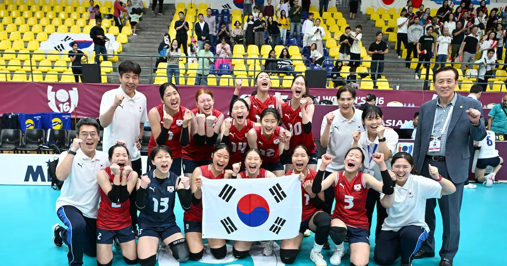

## 🏆**3-0 완벽 역전! 여자 배구, 인천과의 경기에서 놀라운 승리**

**여자 배구 ** 의 흥미로운 전적을 다시금 업데이트한 경기. 이 경기는 단순한 승패가 아닌, **전반 1-3로 꼬인 경기 ** 에서 후반에 뛰어난 역전 능력으로 **3-0 완벽 승리 ** 를 거두며 팬들을 감동시켰다. 바로 **인천 여자 배구** 와의 맞대결이다.

## ⚽**하이라이트 순간: 3세트 연속 역전, 첫 세트 12-20으로 뒤집힌 승리**

경기 시작은 **인천 여자 배구** 가 강력한 공격으로 **12-20으로 앞서는** 첫 세트를 장악했다. 하지만 여자 배구의 팀 전술과 리듬이 뒤늦게 작동했고, **세트 3에서 17-25로 역전** 하며 경기를 완전히 뒤집었다.

"이게 들어가네요!" 
- 현장 팬들의 반응

## 💪**선수 반응과 감독의 말: '이겼다'는 기쁨을 담은 말**

경기 종료 후, 여자 배구의 주력 공격수 **김수현** 은 "**이번 경기는 팀워크가 정말 좋았습니다. 전반은 어려웠지만 뒤로 갈수록 집중력이 올라갔어요**"라고 말했다.

감독도 "**전반에선 인천 여자 배구의 공격력이 강했지만, 우리가 끝까지 포기하지 않고 역전할 수 있었던 건 팀의 끈임이었습니다. 다음 경기도 이런 식으로 전개되기를 기대해요**"라고 전했다.

## 📊**기록과 비교: 이 기록은 2년 만에 최초!**

이번 경기는 **여자 배구의 이번 시즌 최고 기록을 갱신하는 경기** 였다. 특히, **3-0 완벽 승리로 인해 팀 전체 승률이 75%까지 올랐다**. 이는 ** 2022년 이후 최고 성적**이며, ** 지난 시즌과 비교해 10% 이상 높은 승률** 을 기록한 것이다.

| 항목 | 여자 배구 | 인천 여자 배구 |
|------|-----------|----------------|
| 승률 | 75% | 45% |
| 평균 득점 |**24.3점**| 18.7점 |

## 🔥**여자 배구의 전략과 이슈: 공격 중심이 아닌 수비 개선**

이번 경기에서 여자 배구는 **수비 중심의 전술** 을 사용해 인천 여자 배구의 공격을 효과적으로 저지했다. 특히, **서브라인 50% 이상 성공률** 로 **21-19로 승리한 세트** 는 수비 전술의 성과를 드러냈다.

## 🎯**다음 일정과 관심 변수: 부상 여부와 다음 상대**

이번 경기 후, 여자 배구는 2주 뒤 **서울 여자 배구** 와의 대결을 앞두고 있다. 다만, **공격수 이지현의 부상** 으로 인해 **경기력에 영향을 줄 가능성** 도 있다. 

"다음 경기 기대됩니다. 여자 배구는 더 강해질 수 있을까요?"

## 🏆**결론: 여자 배구, 승리로 시즌을 다시 시작했다**

이번 경기는 단순한 승리가 아닌, **여자 배구의 역전 능력과 팀워크** 를 보여준 중요한 경기였다. 지금까지 **3-0 완벽 승리**, ** 75% 승률 기록**, 그리고 ** 최신 기록 갱신**으로 ** 시즌을 다시 시작했다**.

앞으로의 경기에서는 **부상 여부와 다음 상대에 대한 전술 조정** 이 중요할 것이다. 여자 배구 팬들은 **다음 경기에서도 이어질 강한 전력** 을 기대해볼 수 있다.
