## 1. 패키지 생성(new > ABAP Package) 
- 패키지명은 ZWBS_CHART_???(자기 이니셜 : 워크 스페이스 내 중복 패키지 선언 안됨.)

## 2. Database Table 생성 (new > ABAP repository object > Database Table 생성)
- 테이블 생성 데이터(주석은 제거)

```javascript
@EndUserText.label : 'Project PMS Task Table'
@AbapCatalog.enhancement.category : #NOT_EXTENSIBLE
@AbapCatalog.tableCategory : #TRANSPARENT
@AbapCatalog.deliveryClass : #A
@AbapCatalog.dataMaintenance : #RESTRICTED
define table ztwbs_task2 {

  key client      : abap.clnt not null;     //gernerater 생성 필수 컬럼
  key prog_key    : abap.char(30) not null;
  prog_no         : abap.char(10);
  prog_name       : abap.char(100);
  screen_name     : abap.char(100);
  biz_type        : abap.char(20);
  category        : abap.char(20);
  deploy_yn       : abap.char(1);
  dev_type        : abap.char(20);
  developer       : abap.char(12);
  complete_yn     : abap.char(1);
  ui_type         : abap.char(20);
  git_url         : abap.string(0);
  iam_id          : abap.char(30);
  is_relevant     : abap.char(1);
  obj_type        : abap.char(10);
  package_name    : abap.char(30);
  srv_obj         : abap.char(40);
  srv_uri         : abap.string(0);
  created_by      : abp_creation_user;    
  created_at      : abp_creation_tstmpl;     
  last_changed_by : abp_locinst_lastchange_user;     //gernerater 생성 필수 컬럼
  last_changed_at : abp_locinst_lastchange_tstmpl;     //gernerater 생성 필수 컬럼
}
```

<details markdown="1">
<summary><b>Database Table @Annotation 정리 (눌러서 열기)</b></summary>
<div>

### 1. `@EndUserText.label : 'WBS Task Table'`
- **의미:** 테이블의 한글/영문 설명(Description)입니다.
- **쉽게 말해:** SAP GUI나 딕셔너리(SE11)에서 이 테이블을 검색했을 때 옆에 나오는 텍스트 설명입니다. '이 테이블이 무슨 데이터를 담는 곳인지' 사람이 알아볼 수 있게 적어두는 주석 같은 개념입니다.

### 2. `@AbapCatalog.enhancement.category : #NOT_EXTENSIBLE`
- **의미:** 이 테이블의 확장 가능 여부(Enhancement Category)를 결정합니다.
- **쉽게 말해:** SAP 표준 테이블이나 다른 패키지에서 이 테이블 뒤에 새로운 필드를 추가(Append Structure 등)해서 확장하는 것을 막겠다는 뜻입니다. 구조를 딱 고정해두고 안전하게 쓰겠다는 의미이며, 보통 `#NOT_EXTENSIBLE`이나 `#EXTENSIBLE_CHARACTER_NUMERIC` 등을 사용합니다.

### 3. `@AbapCatalog.tableCategory : #TRANSPARENT`
- **의미:** 테이블의 종류(Category)를 지정합니다.
- **쉽게 말해:** SAP 시스템의 딕셔너리 구조와 실제 DB(Oracle, HANA 등)의 물리적 테이블 구조가 1:1로 똑같이 매핑되는 '투명 테이블(Transparent Table)'로 만들겠다는 뜻입니다. SAP에서 가장 기본적이고 99% 이상 사용하는 테이블 형태입니다.

### 4. `@AbapCatalog.deliveryClass : #A`
- **의미:** 테이블의 디리버리 클래스(데이터 성격)를 정의합니다.
- **쉽게 말해:** 이 테이블이 운영 데이터(Application Data)를 담는 곳인지, 아니면 시스템 설정값(Configuration)을 담는 곳인지 지정하는 것입니다.
- `#A` (Application)는 시스템을 운영하면서 사용자들이 계속 밀어 넣는 마스터 데이터나 트랜잭션 데이터(우리가 관리할 프로그램 진척 데이터 등)를 넣을 때 사용합니다.
- 시스템 간 이관(Transport)할 때 데이터는 안 넘어가고 테이블 구조만 넘어가게 됩니다.

### 5. `@AbapCatalog.dataMaintenance` 옵션의 종류
이 옵션에는 크게 3가지 값을 넣을 수 있습니다.
1. **`#ALLOWED`** (가장 많이 씀)
 - **의미:** 데이터 유지가 완전히 허용됨.
 - **효과:** SAP GUI에서 **SE16, SE16N** 같은 트랜잭션을 켜고 데이터를 직접 집어넣거나, 수정하고, 지우는 테스트가 가능해집니다. 개발 서버에서 테스트 데이터를 빠르게 막 집어넣어야 할 때 필수적입니다.
2. **`#RESTRICTED`**
 - **의미:** 제한된 방식으로만 허용됨.
 - **효과:** SE16 같은 툴에서 직접 한 줄씩 고치는 것은 안 되고, 별도로 만들어진 '테이블 유지보수 뷰(Table Maintenance Dialog)' 같은 전용 가공 프로그램을 통해서만 데이터 변경이 가능해집니다.
3. **`#NOT_ALLOWED`**
 - **의미:** 데이터 유지 불가능.
 - **효과:** 사용자가 툴을 이용해 데이터를 강제로 바꿀 수 없습니다. 오직 우리가 짤 ABAP 프로그램 로직(INSERT, UPDATE 구문 등)을 통해서만 데이터가 들어오고 나갈 수 있게 꽁꽁 잠가두는 보안용 옵션입니다.
</div>
</details>

## 3-1. Step 3-step 7(한번에 생성)
테이블 생성 후, 패키지 마우스 우클릭 후, Generate ABAP Repository Object

## 3-2. 데이터 정의 (CDS 인터페이스 뷰) 생성(Data Definition)
- **Name:**`ZI_WBS_TASK`
- **Description:**`WBS Task Interface View`
- **Refernced Object:**`ZTWBS_TASK` (어떤 테이블 또는 뷰에서 데이터를 가져올껀지 선택)
- **Template:**`defineViewEntity`


<details markdown="1">
<summary><b>ZI_WBS_TASK 주석 포함 소스 (눌러서 열기)</b></summary>

```javascript
@AbapCatalog.viewEnhancementCategory: [#NONE]
@AccessControl.authorizationCheck: #NOT_REQUIRED
@EndUserText.label: 'WBS Task Interface View'
@Metadata.ignorePropagatedAnnotations: true
define view entity ZI_WBS_TASK as select from ztwbs_task
{
key prog_key     as ProgKey,   // Key (오브젝트명/프로그램 ID 등)
prog_no      as ProgNo,      // No.
prog_name    as ProgName,    // 프로그램 명
screen_name  as ScreenName,  // 화면 명
biz_type     as BizType,     // 업무 구분
category     as Category,    // 분류
deploy_yn    as DeployYn,    // 운영배포 여부
dev_type     as DevType,     // 개발유형
developer    as Developer,   // 개발 담당자
complete_yn  as CompleteYn,  // 완료여부
ui_type      as UiType,      // 유형
git_url      as GitUrl,      // Git 주소
iam_id       as IamId,       // IAM ID
is_relevant  as IsRelevant,  // 해당여부
obj_type     as ObjType,     // 유형
package_name as PackageName, // 패키지명
srv_obj      as SrvObj,      // 서비스 오브젝트
srv_uri      as SrvUri       // 서비스 URI
}
```

</details>


<details markdown="1">
<summary><b>Template별 용도 (눌러서 열기)</b></summary>

1. defineViewEntity : 가장 표준적이고 성능이 최적화된 신형 데이터 뷰 엔티티를 만드는 템플릿
2. defineRootViewEntity : 인터페이스 뷰를 기반으로 CUD(등록/수정/삭제) 비즈니스 로직의 트랜잭션 대장 역할을 할 최상위 루트 뷰를 만들 때
3. defineTransientViewEntity : 데이터베이스에 물리적으로 저장되지 않고, 런타임 계산이나 임시 매핑용으로만 사용하는 특수한 뷰
4. defineCustomEntity : DB 테이블이 아니라 외부 REST API(OData)나 Java 백엔드 등 외부 데이터 소스를 ABAP 데이터 모델처럼 포장해서 가져올 때 쓰는 커스텀 엔티티 선언부(Spring에서 외부 API 통신용 Client 객체 매핑 느낌)

</details>


## 4. 데이터 정의 (CDS 루트 뷰) 생성(Data Definition)
- **Name:**`ZR_WBS_TASK`
- **Description:**`WBS Task Root View`
- **Refernced Object:**`ZI_WBS_TASK`(인터페이스 뷰 선택)
- **Template:**`defineRootViewEntity`


## 5. 데이터 정의 (CDS 프로젝션 뷰) 생성(Data Definition)
- **Name:**`ZP_WBS_TASK` (보통 ZC_라고 함. 개발가이드에는 ZP_)
- **Description:**`WBS Task Projection View`
- **Refernced Object:**`ZR_WBS_TASK`(인터페이스 뷰 선택)
- **Template:**`defineRootViewEntity` 

<details markdown="1">
<summary><b>추가 수정 (눌러서 열기)</b></summary>

```javascript
1. as select from > as projection on
2. @Metadata.allowExtensions: true //어노테이션 추가
```

</details>

## 6. Metadata Extension (메타데이터 익스텐션) 파일 생성
- 프로젝션 뷰인 `ZP_WBS_TASK`를 마우스 우클릭합니다.
- **New > ABAP Repository Object > Core Data Services > Metadata Extension**
- 정보입력
- **Name:**`ZP_WBS_TASK` (보통 타겟 CDS 뷰와 똑같은 이름을 주면 자동으로 매핑됩니다.)
- **Description:**`WBS Task UI Metadata Extension`

<details markdown="1">
<summary><b>소스 코드 (눌러서 열기)</b></summary>

```javascript
@Metadata.layer: #CUSTOMER
// [의미] 메타데이터 확장 레이어를 정의합니다.
// [설명] SAP RAP 표준, 파트너사, 또는 자체 개발 등 여러 단계의 UI 설정 중 어떤 우선순위를 가질지 결정합니다.
//       #CUSTOMER는 가장 높은 우선순위 레이어 중 하나로, 표준 설정을 덮어쓰고 우리가 정의한 화면을 무조건 보여주겠다는 뜻입니다.

@Search.searchable: true
// [의미] Fiori 화면 상단에 '글로벌 텍스트 검색바(텍스트 기반 전체 검색)'를 활성화합니다.
// [설명] 이 옵션이 켜져 있어야 우측 상단의 돋보기 모양 검색 창에 단어를 쳤을 때 테이블 내의 텍스트들을 긁어와 전체 검색을 수행합니다.

annotate view ZP_WBS_TASK with
{
  // ====================================================================================
  // 1. 상세 화면 (Object Page) 레이아웃 공통 정의
  // ====================================================================================
  // 리스트에서 한 줄을 더블클릭하거나 '상세 보기(>) ' 버튼을 눌렀을 때 진입하는 '상세 페이지'의 기본 레이아웃 뼈대를 만듭니다.
  @UI.facet: [ { id:            'idIdentification',        // 팩셋(영역)의 고유 식별 ID
                 type:          #IDENTIFICATION_REFERENCE, // 화면 형태 구성 방식 (기본 텍스트/필드 그룹 나열 방식)
                 label:         'General Information',     // 상세 화면 탭/섹션에 표시될 한글/영문 타이틀명
                 position:      10 } ]                     // 섹션이 여러 개일 경우 배치될 순서 (10번이 맨 처음)


  // ====================================================================================
  // 2. 각 필드별 UI 배치 및 검색 필드 지정
  // ====================================================================================

  @UI.lineItem: [ { position: 10 } ]       // [조회 표] 리스트 그리드(표)에서 '첫 번째(10)' 컬럼으로 배치합니다.
  @UI.selectionField: [ { position: 10 } ] // [검색창] 상단 조건 검색바에서 '첫 번째(10)' 입력 박스로 배치합니다.
  @UI.identification: [ { position: 10 } ] // [상세 화면] 상세 페이지 내부 'General Information' 섹션의 첫 번째(10) 필드로 배치합니다.
  ProgKey;
  
  @UI.lineItem: [ { position: 20 } ]       // [조회 표] 두 번째(20) 컬럼 배치 (No.)
  @UI.identification: [ { position: 20 } ] // [상세 화면] 두 번째(20) 필드 배치
  ProgNo;
  
  @UI.lineItem: [ { position: 30 } ]       // [조회 표] 세 번째(30) 컬럼 배치 (프로그램 명)
  @UI.selectionField: [ { position: 20 } ] // [검색창] 상단 조건 검색바에서 '두 번째(20)' 입력 박스로 배치하여 검색 조건으로 활용합니다.
  @UI.identification: [ { position: 30 } ] // [상세 화면] 세 번째(30) 필드 배치
  ProgName;
  
  @UI.lineItem: [ { position: 40 } ]       // 화면 명
  @UI.identification: [ { position: 40 } ]
  ScreenName;
  
  @UI.lineItem: [ { position: 50 } ]       // 업무 구분 (E-ACCT 등)
  @UI.selectionField: [ { position: 30 } ] // 업무 구분별로 필터링할 수 있도록 검색창 세 번째(30)에 배치
  @UI.identification: [ { position: 50 } ]
  BizType;
  
  @UI.lineItem: [ { position: 60 } ]       // 분류 (FI-eAcct 등)
  @UI.identification: [ { position: 60 } ]
  Category;
  
  @UI.lineItem: [ { position: 70 } ]       // 운영배포 여부
  @UI.identification: [ { position: 70 } ]
  DeployYn;
  
  @UI.lineItem: [ { position: 80 } ]       // 개발유형 (API, Report 등)
  @UI.identification: [ { position: 80 } ]
  DevType;
  
  @UI.lineItem: [ { position: 90 } ]       // 개발 담당자
  @UI.selectionField: [ { position: 40 } ] // 담당자별 담당 프로그램 조회를 위해 검색창 네 번째(40)에 배치
  @UI.identification: [ { position: 90 } ]
  Developer;
  
  @UI.lineItem: [ { position: 100 } ]      // 완료여부 (Y/N)
  @UI.selectionField: [ { position: 50 } ] // 미완료/완료 건만 모아보기 위해 검색창 다섯 번째(50)에 배치
  @UI.identification: [ { position: 100 } ]
  CompleteYn;
  
  @UI.lineItem: [ { position: 110 } ]      // 유형 (Free Style 등)
  @UI.identification: [ { position: 110 } ]
  UiType;
  
  @UI.lineItem: [ { position: 120 } ]      // Git 주소
  @UI.identification: [ { position: 120 } ]
  GitUrl;
  
  @UI.lineItem: [ { position: 130 } ]      // IAM ID
  @UI.identification: [ { position: 130 } ]
  IamId;
  
  @UI.lineItem: [ { position: 140 } ]      // 해당여부
  @UI.identification: [ { position: 140 } ]
  IsRelevant;
  
  @UI.lineItem: [ { position: 150 } ]      // 유형 (모듈명/오브젝트명 구분용)
  @UI.identification: [ { position: 150 } ]
  ObjType;
  
  @UI.lineItem: [ { position: 160 } ]      // 패키지명
  @UI.identification: [ { position: 160 } ]
  PackageName;
  
  @UI.lineItem: [ { position: 170 } ]      // 서비스 오브젝트
  @UI.identification: [ { position: 170 } ]
  SrvObj;
  
  @UI.lineItem: [ { position: 180 } ]      // 서비스 URI
  @UI.identification: [ { position: 180 } ]
  SrvUri;
}
```

</details>

## 7. Business Object Behavior Definition (행위 정의) 생성<br>(SELECT만 하는 경우, 필요없음)

- CDS Root 뷰 `ZR_WBS_TASK,ZP_WBS_TASK`를 마우스 우클릭
- **New > Behavior Definition** 을 선택
- Implementation type: 자동입력 되므로, 확인만 하면 됨.
- ZR_?의 경우, Managed
- ZP_?의 경우, Projection(Projection이 아닐 경우, 프로젝션 뷰인지 확인)

<details markdown="1">
<summary><b>ZP_?의 경우, 아래의 draft 관련 소스 추가(Create, Update시 필수) (눌러서 열기)</b></summary>

```javascript
managed implementation in class zbp_r_wbs_task unique;
strict ( 2 );
with draft; // 1. 드래프트 기능 활성화 선언!

define behavior for ZR_WBS_TASK
persistent table ztwbs_task
draft table ztwbs_task_d       // 2. 자동으로 만들어질 드래프트 테이블명 지정 (둘째/셋째 자리 밑줄 없음 규칙 준수)
etag master LastChangedAt // 3. ETag 필드 지정 (동시성 체크용)
lock master total etag LastChangedAt // 드래프트 관리를 위한 동시성 체크 필드 지정 (우선 완료여부 필드로 지정)
authorization master ( instance )
{
  create ( authorization : global );
  update;
  delete;

  field ( readonly ) ProgKey;

  // 드래프트 처리를 위해 기본적으로 필요한 액션들 활성화
  draft action Edit;
  draft action Activate;
  draft action Discard;
  draft action Resume;
  draft determine action Prepare;
```

</details>

<details markdown="1">
<summary><b>오류조치1:In CDS, the provider contract "transactional_query" should be defined for the entity "ZP_WBS_TASK” (눌러서 열기)</b></summary>

1. Ctrl + 1
2. Add Implementation class to behavior definition 클릭
3. **소스상단에 “implementationinclass** zbp_p_wbs_task **unique;” 생김**

</details>

<details markdown="1">
<summary><b>오류조치2: class “ZBP_P_WBS_TASK” does not exist (눌러서 열기)</b></summary>

1. Ctrl + 1
2. Create global behavior implmentation class **zbp_p_wbs_task** for behavior **zp_wbs_task**. 클릭 후 생성

</details>

## 8. Service Definition (서비스 정의) 생성

ZP_WBS_TASK 뷰를 OData 서비스에 포함하겠다 정의
- `ZP_WBS_TASK` 우클릭 **(new > Service Definition)**
- 정보입력
- **Name:**`ZUI_WBS_TASK` (UI 서비스 정의는 대개 `ZUI_` 접두사를 많이 씀. 또는 ZSB)
- **Description:**`WBS Task Service Definition`

## 9. Service Binding (서비스 배포) 생성

- 서비스 정의(`ZUI_WBS_TASK`)를 바탕으로, 외부 호출 **OData 프로토콜 API** 형태로 바인딩, 활성화
- `ZUI_WBS_TASK` (Service Definition)를 마우스 우클릭 (**New > Service Binding)**
- 정보 입력
- **Name:**`ZUI_WBS_TASK_O4` (OData V4 버전을 뜻하는 관례적 접두사/접미사 활용)
- **Description:**`WBS Task Service Binding`
- **Binding Type:**`OData V4 - UI`를 선택합니다. *(Fiori Elements나 간트 차트 연동 시 OData V4가 최신 표준 프로토콜.)*
- 먼저 창 상단의 `Ctrl + F3`을 눌러 이 바인딩 오브젝트 자체를 활성화합니다.
- 활성화가 완료되면 화면 중앙 우측에 있는 **`Publish`** 버튼을 클릭합니다.

#### 서비스 바인딩 종류 정리
- **`OData V4 - UI`최신 표준 웹 화면용:** SAP Fiori 표준 Elements 기반의 최신형 웹 화면(CRUD)을 만들 때 사용하는 현업 트렌드 규격입니다.
- **`OData V3 - UI`과거 버전 웹 화면용:** 구형 SAPUI5 아키텍처나 예전 버전의 Fiori 표준 화면과의 하위 호환성을 맞추기 위해 제공하는 구형 규격입니다.
- **`OData V4 - Web API`순수 데이터 연동용(화면X):** 타 시스템이나 모바일 앱, 외부 자바스크립트단에 화면 버튼 없이 순수 데이터(JSON)만 REST API로 쏴줄 때 씁니다.
- **`OData V3 - Web API`과거 버전 데이터 연동용:** 외부 레거시 시스템이 구형 OData V3 규격 통신만 지원할 때 어쩔 수 없이 매핑해 주는 연동용 규격입니다

#### 완성된 화면
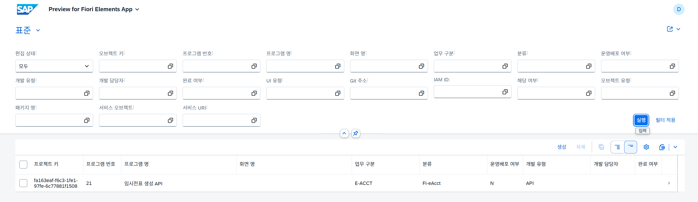

---

## 10. ValueHelp(F4) 설정(옵션)
- 검색 도움말을 주기 위한 Helper설정

<details markdown="1">
<summary> 10-1. CBO테이블 내 데이터 이용하기(눌러서 열기)</summary>

#### 10-1-1. 통합 범주 마스터 테이블 생성
### 테이블 생성 코드(주석은 지워야 됨)

```javascript
@EndUserText.label : 'WBS 통합 범주 마스터 테이블'
@AbapCatalog.enhancement.category : #NOT_EXTENSIBLE
@AbapCatalog.tableCategory : #TRANSPARENT
@AbapCatalog.deliveryClass : #G
@AbapCatalog.dataMaintenance : #ALLOWED
define table ztwbs_category {

  key client      : abap.clnt not null;
  @EndUserText.label : '범주 고유 키'
  key category_uuid : sysuuid_x16 not null; // 1. Managed UUID 자동채번 키
  
  @EndUserText.label : '범주 분류 (예: BIZ_TYPE, UI_TYPE)'
  category_type   : abap.char(20);          // 2. '범주분류' 컬럼
  
  @EndUserText.label : '범주 명 (예: AP, FIORI, 회계)'
  category_name   : abap.char(100);         // 3. '범주명' 컬럼

  // 마법사(Generator) 패스를 위한 필수 표준 시스템 필드 세트
  created_by      : abp_creation_user;
  created_at      : abp_creation_tstmpl;
  last_changed_by : abp_locinst_lastchange_user;
  last_changed_at : abp_locinst_lastchange_tstmpl;

}
```

### 코드설명

```javascript
//로그온 ID(예: CB02029393...)
abp_creation_user
```

#### 10-1-2. 마스터 테이블 오브젝트 자동 생성 (Generator)
-  **`ZTWBS_CATEGORY`** 테이블 우클릭 후, **`Generate ABAP Repository Objects...`** 마법사를 실행

#### 10-1-3. 메인 화면 프로젝션 뷰 (`ZC_TWBS_TASK2`) 수정
### 테이블 데이터 필터링 제약조건 설정

```javascript
...
  // 업무구분 : CategoryType이 'BizType'인 데이터만 필터링하여 가져옴
  @Consumption.valueHelpDefinition: [{
    entity: { name: 'ZC_TWBS_CATEGORY', element: 'CategoryName' },
    additionalBinding: [ { element: 'CategoryType', localConstant: 'BizType', usage: #FILTER } ],
    useForValidation: true
  }]
  BizType,
...
//다른 컬럼들도 알맞게 수정
```

### 코드설명

```javascript
1. @Consumption.valueHelpDefinition: [F4]눌렀을 때, 나오는 Value help
2. additionalBinding, filter : ZTWBS_CATEGORY 테이블 내 데이터 특정 값만 필터
```

</details>


<details markdown="1">
<summary><b>10-2. 콤보박스(DropDown) 만들기(눌러서 열기)</b></summary>

10-2-1. ZTWBS_YN_MASTER **CBO** 테이블 생성

```javascript
@EndUserText.label : 'Y/N 콤보박스 마스터 테이블'
@AbapCatalog.enhancement.category : #NOT_EXTENSIBLE
@AbapCatalog.tableCategory : #TRANSPARENT
@AbapCatalog.deliveryClass : #C
@AbapCatalog.dataMaintenance : #ALLOWED
define table ztwbs_yn_master {

  key client  : abap.clnt not null;
  key yn_code : abap.char(1) not null;
  yn_text     : abap.char(20);

}
```

10-2-2. ABAP 클래스 생성(NEW > ABAP CLASS)한 후, interfaces ADD > IF_OO_ADT_CLASSRUN<br>* Active 후, F9(실행)

```javascript
...
METHOD if_oo_adt_classrun~main.
   " 이안에 로직 생성
DATA lt_data TYPE TABLE OF ztwbs_yn_master.
  " ==================== AP ====================
  lt_data = VALUE #(
    ( yn_code = 'Y' yn_text = '예' )
    ( yn_code = 'N' yn_text = '아니오' )
  ).

    MODIFY ztwbs_yn_master FROM TABLE @lt_data.

    out->write( lt_data ).
    "종료
  ENDMETHOD.
ENDCLASS.
...
```

10-2-3. ZC_TWBS_YN_MASTER 프로젝션 뷰 생성

```javascript
@AbapCatalog.viewEnhancementCategory: [#NONE]
@AccessControl.authorizationCheck: #NOT_REQUIRED
@EndUserText.label: 'Y/N 콤보박스 프로젝션 뷰'
@Metadata.ignorePropagatedAnnotations: true
@ObjectModel.resultSet.sizeCategory: #XS -- 콤보박스 형태로 화면 컴포넌트 강제 전환

define root view entity ZC_TWBS_YN_MASTER
  as select from ztwbs_yn_master
{
  key yn_code as YnCode,
  yn_text as YnText
  
  -- DB에 저장된 순수 텍스트('예')와 코드('Y')를 결합하여 
  -- 화면단 OData 파이기구에 '예(Y)', '아니오(N)' 형태로 포맷을 완성해 전달합니다.
  -- concat( concat( yn_text, '(' ), concat( yn_code, ')' ) ) as DisplayText
}

```

10-2-4. ZC_TWBS_TASK2 인터페이스 뷰에 콤보박스 설정

```javascript
@Consumption.valueHelpDefinition: [{
  entity: { name: 'ZC_TWBS_CATEGORY', element: 'CategoryName' },
  additionalBinding: [ { element: 'CategoryType', localConstant: 'DevType', usage: #FILTER } ],
  useForValidation: true
}]
DevType,
```

</details>

<details markdown="1">
<summary> <b>10-3 표준 도메인 사용하기(눌러서 열기)</b></summary>

- complete_yn 완료 여부를 체크박스 또는 콤보박스로 설정

```javascript
//체크박스(도메인에 따라 기본 UI 다름)
//ZTWBS_TASK2 테이블 도메인 변경
complete_yn     : abap_boolean;  //XFELD 더이상 사용하지 않음.

//ZC_TWBS_TASK2 인터페이스뷰 변경
@Metadata.renderHint: [ #COMBOBOX ] 
CompleteYn;
```

</details>

<details markdown="1">
<summary> <b>10-4 달력 만들기(눌러서 열기)</b></summary>

### ZTWBS_TASK2 테이블 내 컬럼 속성을 날짜 타입으로 생성

```javascript
start_date      : abap.dats;
```

### 메타데이터 익스텐션에 설정

```javascript
// 날짜 하루 입력
@Consumption.filter.selectionType: #SINGLE
// 날짜 구간 값 입력
@Consumption.filter.selectionType: #INTERVAL
```

</details>

---
## 10. IAM APP 생성
New > Create IAM App

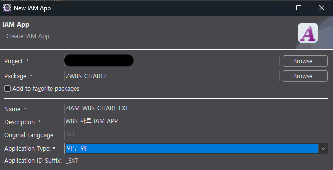

## 11. Business Catalog 생성

1. New > Create Business Catalog
2. Create a new Business Catalog and assign the App to it 클릭
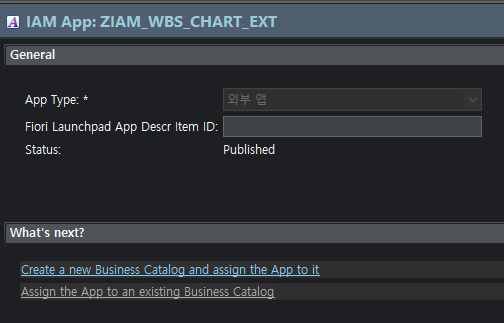
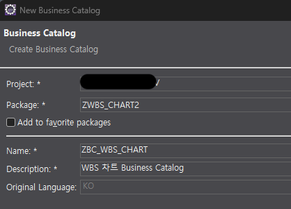
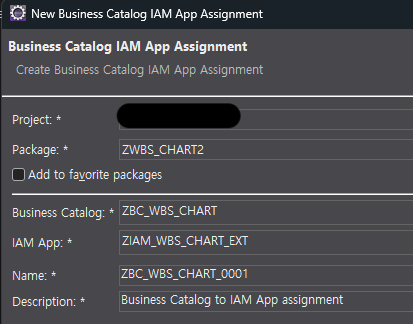


## 12. IAM Service Insert & Business Catalog Publish 

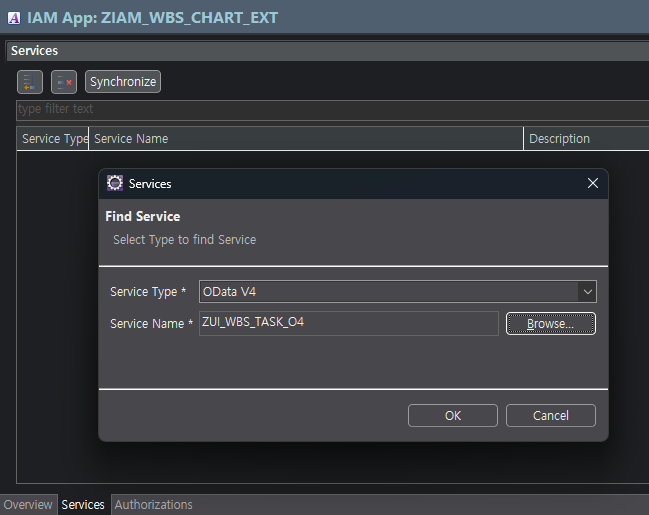
1. “10. IAM 생성”에서 만든 ZIAM_WBS_CHAT_EXT 마우스 우클릭 후, service 선택
2. Service Type : OData V4
3. Service Name : ZUI_WBS_TASK_O4
4. Save > Active(Ctrl + F3)
5. Business Catalog에서 우측 상단 Publidh Locally 클릭
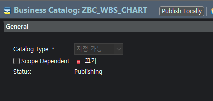
- **Service Binding :**`.../sap/opu/odata4/.../twbs_task2` 라는 백엔드 API 주소 생성
- IAM APP 생성 : 시큐리티 컨텍스트에 API 주소를 등록하는 행위
- Business Catalog 구성 : IAM App을 카탈로그에 설정 > 메뉴등록?…

## 13. 비즈니스 역할 유지보수 추가
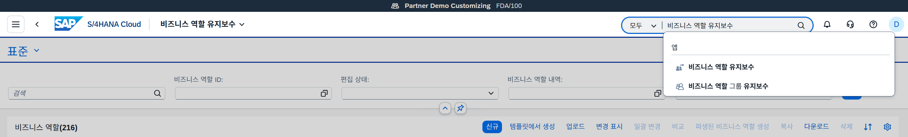


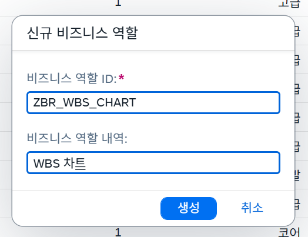


- **비즈니스 역할 ID**: ZBR_??? (Z + Business + Role)
- **비즈니스 역할 내역**:
  - 조회와 수정(CRUD) 모두 가능한 권한인 경우:
    - `WBS 일정 관리자 역할`
    - `PMS WBS 차트 편집 권한`
    - `프로젝트 일정 및 태스크 관리자`
  - 현업 배포용 표준 권한인 경우:
    - `WBS 차트 운영 권한`
    - `프로젝트 WBS 일정 관리` 

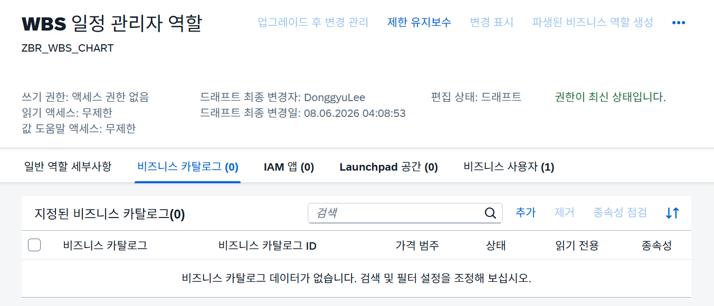
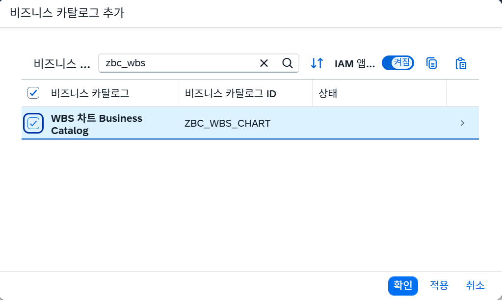

1. 비즈니스 카탈로그 탭에서 [추가] > Business Catalog명(ZBC_WBS_CHART) 입력
2. 비즈니스 사용자 탭에서 [추가] 
3. 일반 역할 세부사항 > 엑세스 범주 무제한으로 설정
4. [저장] 

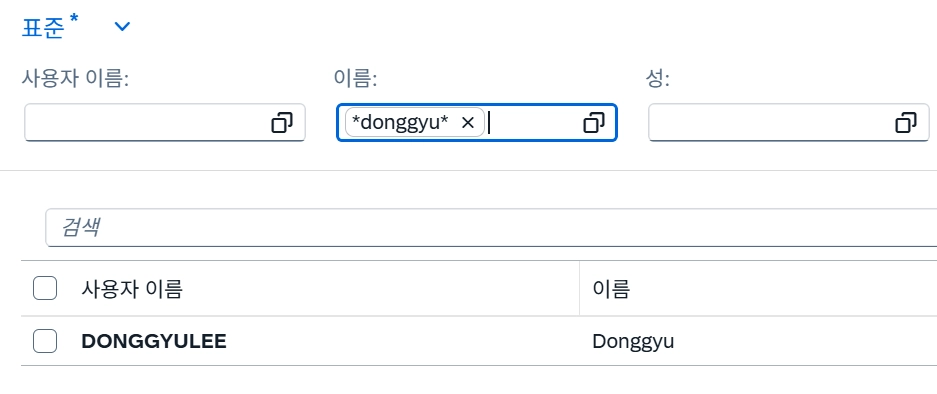
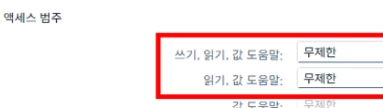
---

## 14. Set Release State(릴리즈 해야 배포가 되는 듯)

1. 이클립스 DEV Server > 서비스 바인딩(ZUI_TWBS_TASK2_O4) 
2. Service > API State에서 Not Release 확인 후, 마우스 우클릭
3. Use in Cloud Development / Use in Key User Apps 체크박스 활성화
4. [Next] > [Finish]

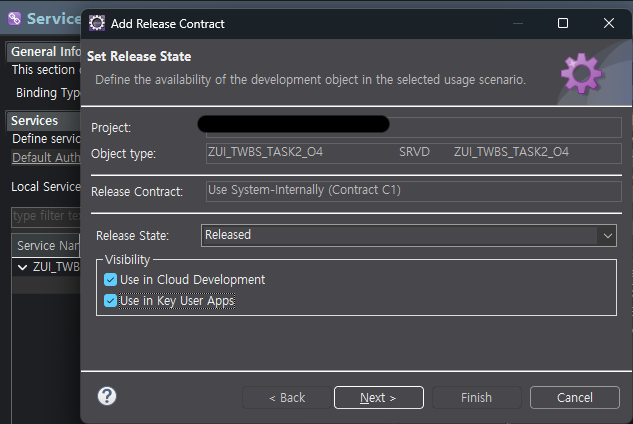


## 15. Fiori App 생성(vscode:서버정보입력 > eclipse:create firoi app > vscode)

1. Connection Manager for SAP Systems
2. Add SAP System
3. 정보입력 > Test Connection > Save
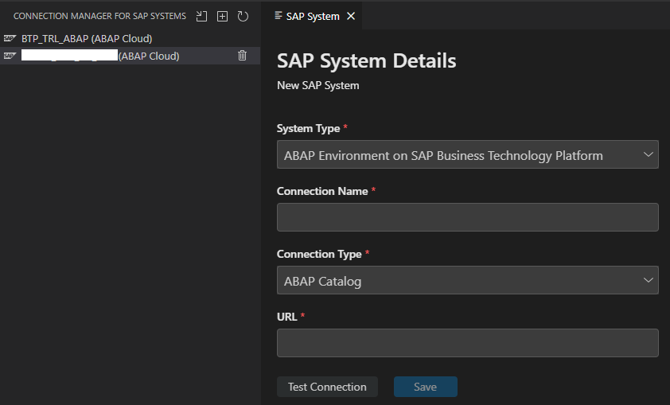

1. Service Binding: ZUI_TWBS_TASK2_O > Create a SAP Fiori App…
2. Create SAP Fiori project and app with External IDE 선택 > Create<br>(웹 로그인 화면이 뜨고, VsCode로 자동으로 이동 후, SAP Fiori Generator가 뜬다.)
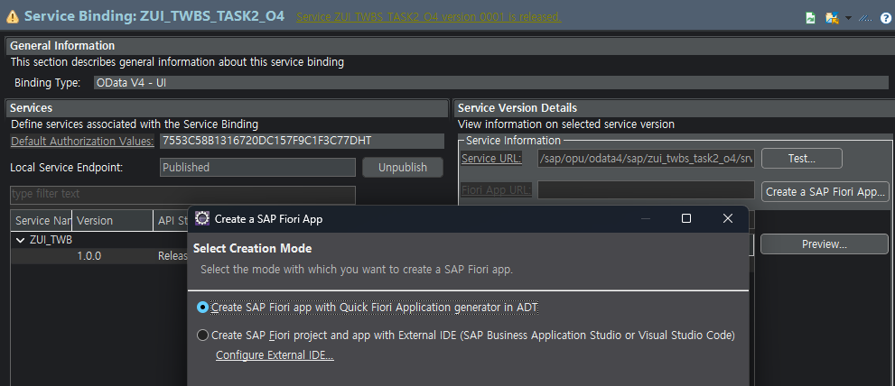

1. **SAP Fiori Generator** 에서 Template Selection이 뜨면, List Report Page 선택
2. **Entity Selection**
- Main Entity: 마스터 CDS 뷰 선택 - 보여지는 화면용
- Automatically add table … already exists?
- Yes : 로컬 `annotation.xml` 파일에 자동으로 생성(CDS MetaDataExtention 무시)
- No : CDS MetaDataExtention을 작성했다면, 백엔드의 세부 속성
- Table Type: GRID(Responsive 는 200개 이상 시 지연발생 가능성)

<details markdown="1">
<summary><b>※ 아키텍쳐 방향성 및 BE,FE간 명확한 역할(Role Separation) 지정 (눌러서 열기)</b></summary>
<div>

### 백엔드 레이어 (SAP RAP)
**핵심 가치: 데이터의 무결성 및 시스템 거버넌스 보장**
- **데이터 검증 (Validation):** 필수 값 입력 여부, 날짜 선후 관계 정합성, 비즈니스 규칙 위반 체크 등 데이터가 DB에 반영되기 전 최종 관문 역할 수행.
- **비즈니스 로직 처리:** Determination 및 Action 기능을 통한 상태 값 자동 변경, 백엔드 마스터 데이터와의 연동 및 가공.
- **표준 API 공급 (OData v4):** Fiori 화면 뿐만 아니라 타 시스템이 언제든 가져다 쓸 수 있는 순수하고 가독성 높은 OData 인터페이스 제공.
### 프런트엔드 레이어 (SAP Fiori / UI5)
**핵심 가치: 유연하고 독립적인 사용자 경험(UX) 및 화면 최적화**
- **화면 디자인 및 레이아웃 제어:** 테이블 컬럼의 배치 순서, 그리드 너비, 정렬 규칙 등을 백엔드 소스 수정 없이 독립적으로 튜닝.
- **고도화 컴포넌트 구현:** Fiori Elements 표준 템플릿 영역을 넘어, WBS일정 관리를 위한 대망의 간트 차트 라이브러리(`sap.gantt`)를 화면에 심고 커스텀 웹 코딩 진행.
- **완벽한 다국어 관리 (i18n):** 캐시나 세션 꼬임에 영향을 받지 않도록 `i18n.properties` 구조를 통해 브라우저 세션에 따른 한글/외국어 라벨링 100% 보장.

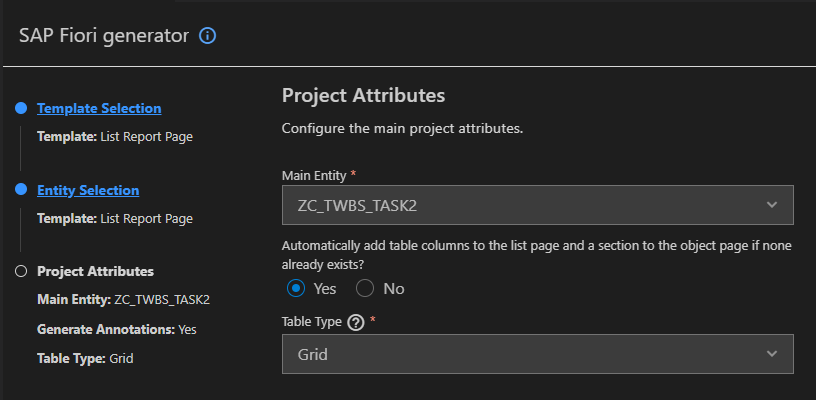

1. Project Attributes 필드별 세부 설명
- **기본정보**
- **Module Name : ** 생성될 실제 **로컬 프로젝트 폴더명, 시스템 내 고유한 ID** 역할<br>영문 소문자와 언더바(`_`), 하이픈(`-`) 조합을 추천(예: `zwbs_chart`)
- **Application Title: ** 웹 브라우저 탭이나 시스템 상단의 **앱 제목<br>**(예: `WBS 일정 관리 시스템`)
- **Application Namespace:** 내부에서 고유한 영역을 나누는 자바의 패키지 경로 개념<br>(예: `com.dev.wbschart`)
- **Description:** 프로젝트에 대한 간단한 한 줄 설명
- **환경 및 경로 설정**
- **Project Folder Path: ** 소스 코드가 저장될 **컴퓨터의 실제 로컬 디렉토리 경로**
- **Minimum SAPUI5 Version : ** 앱이 구동될 **SAPUI5 시스템 라이브러리 최소 버전**
- **하단 옵션 최종 세팅 규칙 및 이유(백엔드는 거버넌스 통제, 화면은 Fiori 중심)**
- **Enable TypeScript ➔**`No`**
- SAPUI5 표준 XML 뷰와 자바스크립트 컨트롤러 아키텍처를 기반으로 프리스타일 간트 차트를 코딩할 예정이므로 `No`로 유지합니다.
- **Add Deployment Configuration ➔**`No`** or **`Yes`**(16번 배포 설정 참고)**
- 지금 당장 개발 서버의 패키지 이름이나 Transport Request(TR) 번호를 넣고 배포 셋업을 하면 복잡해집니다. 로컬에서 UI5 화면을 완벽하게 완성한 후, 나중에 터미널 명령어(`npx fiori add deploy-config`)로 한 번에 붙이는 것이 훨씬 효율적입니다.
- **Add SAP Fiori Launchpad Configuration ➔**`No`** or **`Yes`**(16번 배포 설정 참고)**
- 배포 설정을 `No`로 했기 때문에 서버용 런치패드 타일 등록 설정도 세트로 `No` 처리합니다. 이것 역시 개발 완료 후 터미널 명령어 하나로 추가 가능합니다.
- **Use Virtual Endpoints for Local Preview ➔**`Yes`
- **핵심 옵션입니다.** 서버에 배포하지 않더라도, 내 컴퓨터(`localhost`)에서 가상 엔드포인트를 통해 사내 SAP 백엔드 서버의 OData 실제 데이터를 실시간으로 안전하게 땡겨와 화면을 띄워주는 역할을 합니다. 반드시 `Yes`로 둡니다.
- **Configure Advanced Options ➔**`No`**
- 프록시 세팅이나 UI5 버전을 수동으로 강제 오버라이딩하는 고급 설정을 생략하기 위해 `No`로 둡니다.
<columns>
<column ratio="75">
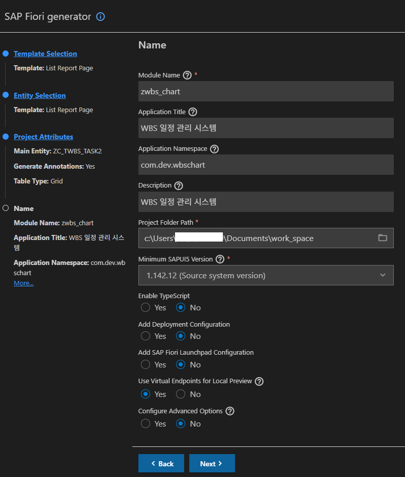
</column>
<column ratio="25">
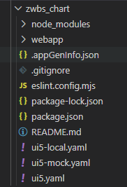
<empty-block/>
</column>
</columns>

</div>
</details>

<details markdown="1">
<summary><b>※ 프로젝트 구조 설명 (눌러서 열기)</b></summary>

- **webapp 폴더 (FE Source)**
- 화면을 디자인하고, 한글 라벨을 고치고, 간트 차트를 구현할 메인 소스 폴더
- **manifest.json**: 앱의 등록정보 파일로, 백엔드 서비스 경로, 다국어 설정, 화면 이동 규칙
- **i18n/i18n.properties**: 화면에 노출될 다국어 텍스트 라벨을 직접 관리하는 파일
- **ext/**: 향후 프리스타일 간트 차트 컴포넌트를 심기 위해 표준 화면을 확장 소스 코드
- ** ui5*.yaml 파일 (로컬 가상 서버 환경 세팅)**
- **ui5.yaml**: 프로젝트의 기본적인 빌드 및 라우팅 설정 파일
- **ui5-local.yaml**: 로컬 프리뷰를 띄울 때 핵심이 되는 파일로, 사내 SAP 백엔드 개발 서버 시스템으로 데이터 요청을 안전하게 우회시켜주는 가상 프록시 정보가 정의
- **ui5-mock.yaml**: 백엔드 오류 시, 로컬용 데이터를 제공해 주는 Mock 서버 세팅
### package.json 및 node_modules
- Node.js 기반 의존성 관리 및 빌드 스크립트 라이프사이클이 정의

</details>

## 16. 배포 설정
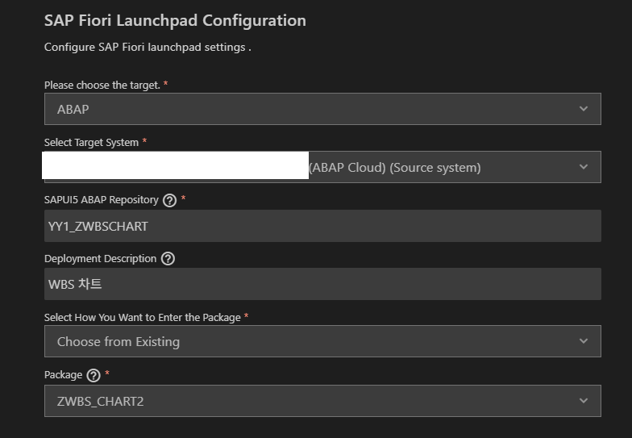


1. **Please choose the target, Select Target System**: 기본설정
2. **SAPUI5 ABAP Repository**: 명명규칙 참고
3. 프론트 Deploy 네이밍
4. YY1_Z+회사명+모듈+0010
5. YY1_ZUMRMM0010, YY1_ZJUGSMM0010, YY1_ZWDXMM0010, YY1_ZITMSD0010
6. **Deployment Description**: 설명
7. **Select How You Want to Enter the Package**: Choose from Exsting
8. **Package**: 배포하려는 패키지
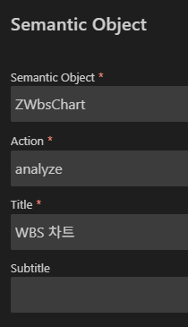
9. **Semantic Object**: URL에 노출되는 이름
10. **Action(UI스타일**): diaplay(조회-단순 List Report), analyze(분석)
11. **Title**: 상단 제목
12. **Subtitle**: 부제목(*사용하지 않음)

### 17. Fiori App 실행
**프로젝트 폴더에 **`node_modules`** 폴더가 존재한다면 **`npm install`** 을 생략하고 바로 **`npm start`**

```bash
$ cd [프로젝트명]
$ npm install
$ npm start
```

### 18. TR(Transport Request) 생성(DEV/CUSTOM에는 불필요)
Short Description에 설명만 넣고 Finish

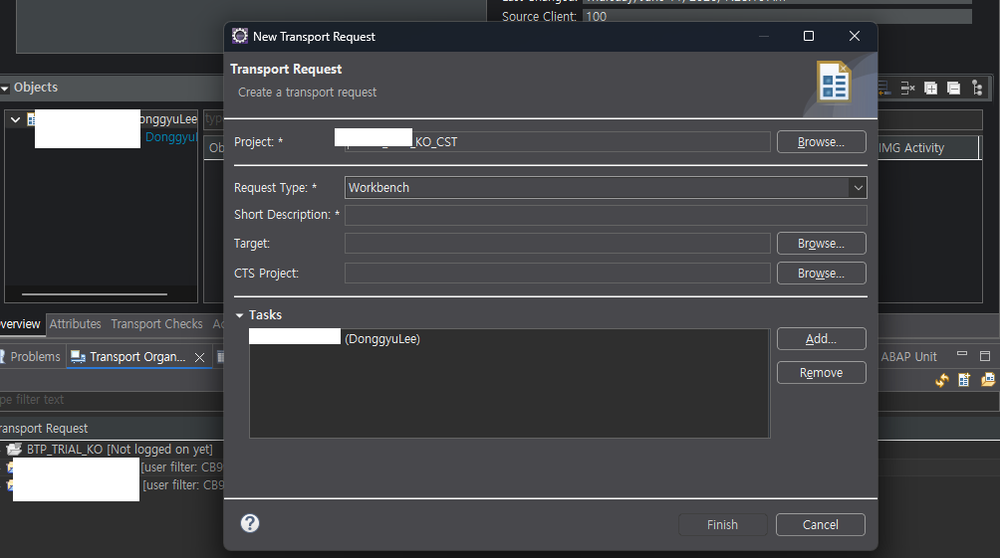
TR 번호 복사

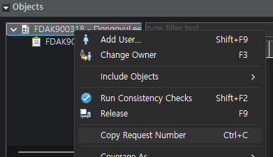
VSCODE 터미널에서 배포

```abap
$ npm run deploy
```

### 19. yaml 파일 변경
- custom 서버로 URL 변경
- client No. 변경(일반적으로 개발서버 080 > 커스텀서버 100)
- url: https://myXXX123… > url: https://myXXX567…


### 20. 사용자 정의 카탈로그 확장 등록
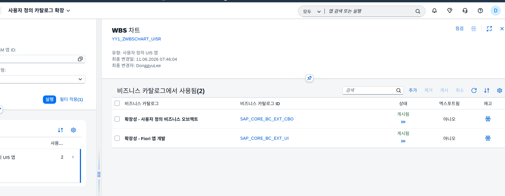
- [추가] > 검색 (SAP_CORE_BC_EXT_CBO / SAP_CORE_BC_EXT_UI) > [Add] > [게시]
