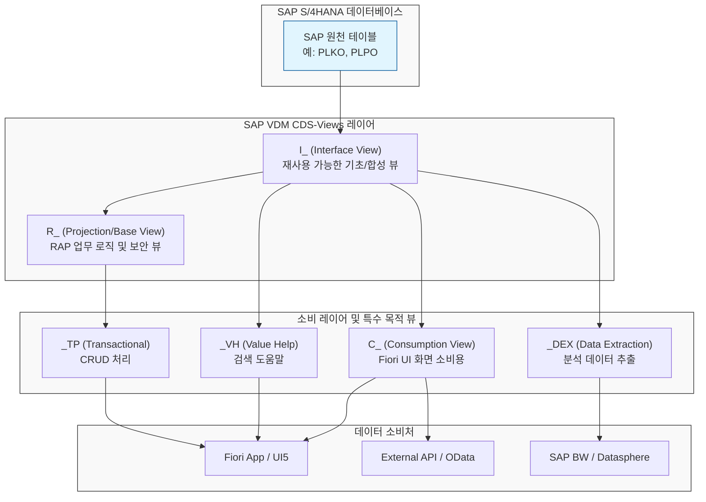

---
# 1. `I_PRODNROUTINGOPSUBORDOPDEX` 상세 해부
이 객체는 SAP S/4HANA (2023 SPS04 이상 버전) PP(생산관리) 모듈의 표준 CDS 뷰로, 명칭은 다음과 같이 결합하여 구성된 형식입니다.
<table header-row="true" markdown="1">
<tr>
<td>약어</td>
<td>풀네임 (Full Name)</td>
<td>설명</td>
</tr>
<tr>
<td>**`I_`**</td>
<td>**Interface View**</td>
<td>VDM의 가장 표준적인 재사용 가능 데이터 모델 레이어 (인터페이스 뷰)</td>
</tr>
<tr>
<td>**`PRODN`**</td>
<td>**Production**</td>
<td>생산 (PP 모듈 영역)</td>
</tr>
<tr>
<td>**`ROUTING`**</td>
<td>**Routing**</td>
<td>라우팅 (공정 흐름)</td>
</tr>
<tr>
<td>**`OP`**</td>
<td>**Operation**</td>
<td>공정 (작업 단계)</td>
</tr>
<tr>
<td>**`SUBORD`**</td>
<td>**Subordinate**</td>
<td>하위 / 종속된</td>
</tr>
<tr>
<td>**`OP`**</td>
<td>**Operation**</td>
<td>공정 (작업 단계)</td>
</tr>
<tr>
<td>**`DEX`**</td>
<td>**Data Extraction**</td>
<td>데이터 추출용 (BW, Datasphere, GCP 등 외부 연동 목적)</td>
</tr>
</table>
-**종합 의미: ** 생산 라우팅의 **하위 공정(Subordinate Operation)** 에 대해 **데이터 추출(Data Extraction)이 가능하도록 설계된 표준 인터페이스 CDS 뷰** 입니다.
---
# 2. SAP CDS VDM 아키텍처 흐름도
각 접두사와 접미사가 실제 개발 아키텍처에서 어떤 레이어에 위치하며 어떤 목적으로 사용되는지 보여주는 흐름도입니다.

---
# 3. SAP CDS View 명명 규칙 가이드
## 📌 1. 대표적인 접두사 (Prefix) 규칙.
<table header-row="true" markdown="1">
<tr>
<td>접두사</td>
<td>정식 명칭</td>
<td>설명</td>
<td>비고</td>
</tr>
<tr>
<td>**`I_`**</td>
<td>**Interface View**</td>
<td>데이터 모델의 기초(Basic) 및 합성(Composite) 뷰입니다. 테이블을 직접 조회하거나 조인하여 비즈니스 엔터티화한 **재사용 가능 핵심 레이어** 입니다.</td>
<td>표준 SAP 제공</td>
</tr>
<tr>
<td>**`C_`**</td>
<td>**Consumption View**</td>
<td>UI 화면(Fiori), OData 서비스, 혹은 분석 쿼리에서 **직접 소비할 수 있도록 최적화된 뷰** 입니다.</td>
<td>표준 SAP 제공</td>
</tr>
<tr>
<td>**`R_`**</td>
<td>**Restricted / Reuse View**</td>
<td>RAP(RESTful ABAP Programming) 아키텍처에서 수정 불가능한 기본 엔터티 구조(Base Entity)를 정의할 때 주로 사용합니다.</td>
<td>신규 개발 표준 권장</td>
</tr>
<tr>
<td>**`P_`**</td>
<td>**Private View**</td>
<td>SAP 내부 로직용 뷰이거나 파라미터 전달 목적의 뷰입니다. 외부에서 참조하거나 직접 확장하는 것이 권장되지 않습니다.</td>
<td>SAP 내부 전용</td>
</tr>
<tr>
<td>**`A_`**</td>
<td>**Remote API View**</td>
<td>외부 시스템 연동을 위해 노출(Expose)하기 위한 전용 API CDS 뷰입니다.</td>
<td>외부 연동용</td>
</tr>
<tr>
<td>**`Z`**/**`Y`**</td>
<td>**Custom Namespace**</td>
<td>C_ 또는 I_ 뒤에 붙어서 개발자 정의(CBO) 오브젝트임을 명시합니다. (예: `ZI_SalesOrder`, `ZC_SalesOrder`)</td>
<td>**CBO 개발 시 필수**</td>
</tr>
</table>
---
## 📌 2. 대표적인 접미사 (Suffix) 규칙
CDS 뷰에 특수한 비즈니스 기능(Value Help, 트랜잭션, 데이터 분석 등)을 부여할 때 이름 끝에 붙이는 규칙입니다.
<table header-row="true" markdown="1">
<colgroup>
<col width="137.34375">
<col width="123.65625">
<col width="391">
</colgroup>
<tr>
<td>접미사</td>
<td>정식 명칭</td>
<td>용도 및 설명</td>
</tr>
<tr>
<td>**`_VH`**</td>
<td>**Value Help**</td>
<td>Fiori 화면 등에서 돋보기 버튼을 눌렀을 때 나오는 **값 도움말(F04 Search Help) 목록** 을 제공하는 전용 뷰입니다.</td>
</tr>
<tr>
<td>**`_TP`**</td>
<td>**Transactional Processing**</td>
<td>RAP 또는 BOPF 프레임워크와 결합하여 데이터의 **CUD(생성/수정/삭제) 및 Draft 기능(임시저장)을 지원** 하는 트랜잭션 처리용 뷰입니다.</td>
</tr>
<tr>
<td>**`_DEX`**(또는 **`DEX`**)</td>
<td>**Data Extraction**</td>
<td>SAP BW/4HANA, SAP Datasphere 또는 외부 클라우드 데이터 웨어하우스(GCP, AWS 등)로 데이터를 효율적으로 넘기기 위해 **CDC(Change Data Capture) 및 ODP(Operational Data Provisioning) 추출이 활성화된 뷰** 입니다.</td>
</tr>
<tr>
<td>**`_Text`**(또는 **`_T`**)</td>
<td>**Text View**</td>
<td>코드 테이블의 언어코드(Spras)별 **다국어 텍스트 필드를 맵핑 및 제공** 하기 위한 뷰입니다.</td>
</tr>
<tr>
<td>**`_Cube`**</td>
<td>**Analytical Cube**</td>
<td>다차원 분석 보고서의 소스가 되는 집계 대상 데이터를 들고 있는 분석용 큐브(Cube) 뷰입니다.</td>
</tr>
<tr>
<td>**`_Query`**(또는 **`_Q`**)</td>
<td>**Analytical Query**</td>
<td>다차원 분석 화면(예: Fiori Design Studio)에서 최종적으로 사용자에게 보고서 형태로 출력되는 쿼리 뷰입니다.</td>
</tr>
<tr>
<td>**`_Std`**</td>
<td>**Standard**</td>
<td>공통 기준 정보나 세팅 값을 제공하는 마스터 기준 뷰입니다</td>
</tr>
</table>
---
