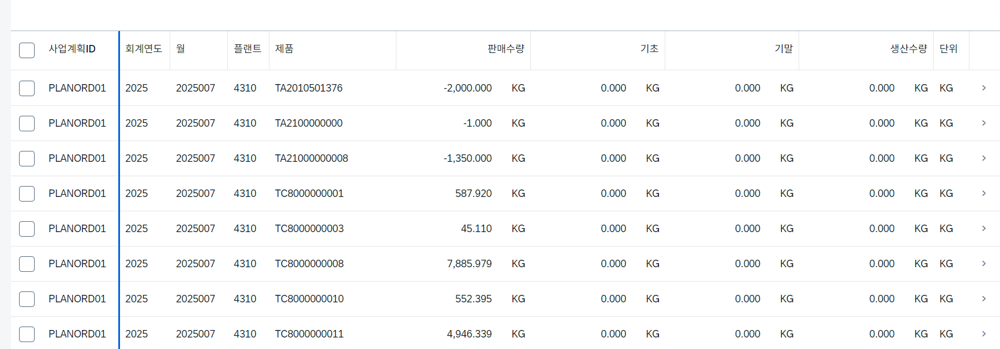

[https://community.sap.com/t5/technology-q-a/remove-uom-from-value-from-query-result-set-from-fiori-app/qaq-p/12660216](https://community.sap.com/t5/technology-q-a/remove-uom-from-value-from-query-result-set-from-fiori-app/qaq-p/12660216)



## 1. `annotation.xml` 파일 열기
웹 개발 환경에서 개발 중인 앱 프로젝트 내부의 `webapp` -> `annotations` ->**`annotation.xml`** 파일을 엽니다.
## 2. 소스 코드 추가
해당 파일의 `<Schema>` 태그 내부에 아래와 같이 각 수량 필드별 타겟을 지정하고, `Measures.Unit` 속성의 String 값을 공백(`" "`)으로 명시하여 매핑을 강제로 끊어줍니다.

```plain text
<Annotations Target="[서비스네임스페이스].[엔티티타입명]/SalesProduct">
    <Annotation Term="Measures.Unit" String=" "/>
</Annotations>

<Annotations Target="[서비스네임스페이스].[엔티티타입명]/OpeningStock">
    <Annotation Term="Measures.Unit" String=" "/>
</Annotations>

<Annotations Target="[서비스네임스페이스].[엔티티타입명]/ClosingStock">
    <Annotation Term="Measures.Unit" String=" "/>
</Annotations>

<Annotations Target="[서비스네임스페이스].[엔티티타입명]/ProductionQty">
    <Annotation Term="Measures.Unit" String=" "/>
</Annotations>
```

*(참고: **`[서비스네임스페이스]`** 와 **`[엔티티타입명]`** 부분은 해당 **`annotation.xml`** 상단 구문이나 **`metadata.xml`** 을 참고하여 프로젝트에 맞게 매핑하셔야 합니다.)*
## 3. 상단 네임스페이스 선언 확인
만약 `<edmx:Reference>` 설정이 누락되어 오류가 난다면, `annotation.xml` 파일 최상단 부근에 아래 Measures 어휘집(Vocabulary) 참조가 포함되어 있는지 확인해 주세요.

```plain text
<edmx:Reference Uri="https://oasis-tcs.github.io/odata-vocabularies/vocabularies/Org.OData.Measures.V1.xml">
    <edmx:Include Namespace="Org.OData.Measures.V1" Alias="Measures"/>
</edmx:Reference>
```

## 이 방식의 장점
- CDS 뷰 레벨에서는 `QUAN` 및 `@Semantics` 구조가 깨지지 않아 표준 검사를 정상 통과합니다.
- Fiori UI 로직에서만 수량 필드의 참조 단위를 "없음(공백)"으로 인식하므로 숫자 옆의 `KG` 텍스트가 전부 사라집니다.
- 별도로 세팅한 우측의 '단위' 컬럼은 순수 텍스트 필드로 여전히 유지됩니다.
