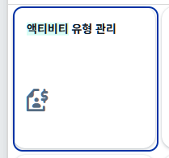

## 1. 개요



SAP Fiori Launchpad(FLP)에서 앱 타일(Tile)에 표시되는 아이콘을 변경하거나 추가하고 싶을 때는 프로젝트의 `manifest.json` 설정 파일을 수정합니다. [SAP Icon Explorer](https://sdk.openui5.org/test-resources/sap/m/demokit/iconExplorer/webapp/index.html#/overview/SAP-icons/?search=product&icon=factory)에서 제공하는 표준 아이콘 이름을 활용하여 원하는 이미지를 타일에 바인딩할 수 있습니다.

## 2. manifest.json 설정 위치 및 방법
`manifest.json` 파일 내 `sap.app` 속성 하위의 **`crossNavigation`**->**`inbounds`** 영역에서 수정을 진행합니다.

```plain text
"sap.app": {
  ...
  "crossNavigation": {
    "inbounds": {
      "z**co0030-display": {
        "semanticObject": "z**co0030",
        "action": "display",
        "title": "{{z**co0030-display.flpTitle}}",
        "subtitle": "{{z**co0030-display.flpSubtitle}}",
        "icon": "sap-icon://factory", 👈 [이곳을 수정]
        "signature": {
          "parameters": {},
          "additionalParameters": "allowed"
        }
      }
    }
  }
}
```

## 3. SAP Icon Explorer 연계 적용 
1. **SAP Icon Explorer** 사이트에 접속하여 원하는 키워드(예: `product`, `factory` 등)로 아이콘을 검색
2. 검색된 아이콘 리스트 중 마음에 드는 아이콘을 클릭
3. 세부 정보 창에 나오는 **Icon Name**(예: `factory`, `add-product` 등)을 그대로 복사
4. `manifest.json` 파일의 `"icon"` 값 뒤쪽에 접두사(`sap-icon://`)와 함께 붙여넣습니다.
- 예시 (`factory` 선택 시): `"icon": "sap-icon://factory"`
- 예시 (`add-product` 선택 시): `"icon": "sap-icon://add-product"`
## 4. 주의사항 및 체크리스트
- **대소문자 구분**: 아이콘 이름은 소문자와 하이픈으로 구성된 표준 명칭을 정확하게 입력
- **캐시 리프레시**: `manifest.json`을 수정하고 서버에 배포한 후 Fiori Launchpad 화면에서 아이콘이 즉시 바뀌지 않는다면, 브라우저 캐시를 모두 비우거나 하드 새로고침(Ctrl + F5 / Cmd + Shift + R)을 수행
