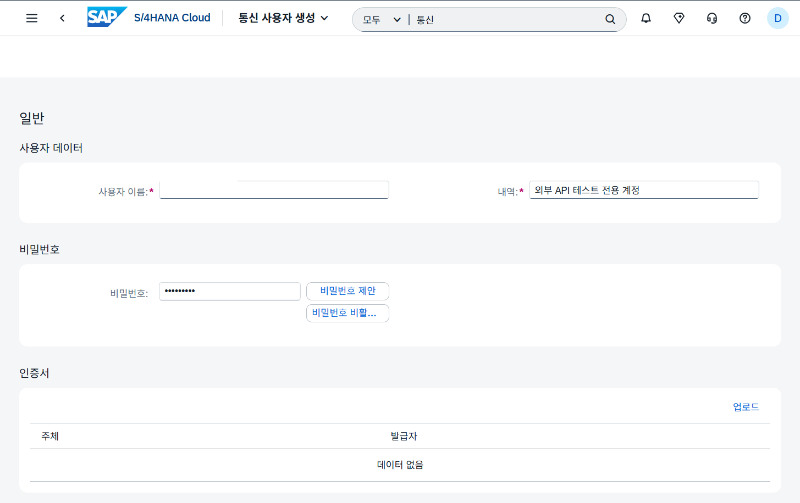
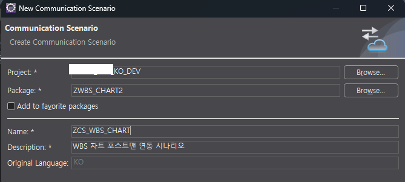
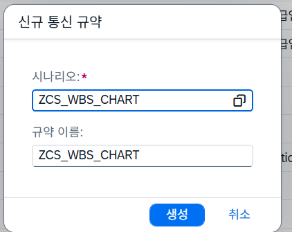
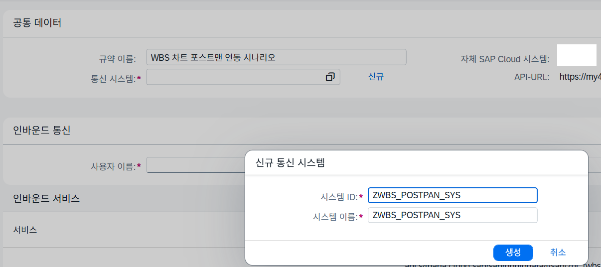

## 1. 통신 사용자 유지 보수(Maintain Communication Users)

- 목적 : API 전용 계정 발급
- 사용자 이름: 임의 지정
- 내역: 테스트 시나리오 설명

## 2. 통신 시나리오 객체 생성

- 커뮤니케이션 시나리오 생성 New > Create Communication Scenario
- **Name:**`ZCS_WBS_CHART` (영문 대문자 ID)
- **Description:**`WBS 차트 포스트맨 연동 시나리오`

- Inbound 탭 선택 > Add… > [Inbound Services 내 Service Binding과 같은 이름의 ?_G4BA]
- **Communication Scenario: ZCS_WBS_CHART > Publish Locally**
## 3. 앱 검색 > 통신규약(Communication Arrangements)

- 신규 등록

- 통신 시스템 신규 등록
- 인바운드만 ✅
- 인바운드 통신 사용자 등록 : CB9980000095

- 사용자 이름 지정 후 저장
## 4. Postman에 Authorization 등록

- Auth Type : Basic Auth
- Username : [앞서 지정한 ID]
- Password : [앞서 지정한 PW]
