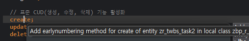

early numbering으로 채번하는 경우, key field 필수

## 1. early numbering


- Behavior Definition 수정

```abap
...
// 여기에 early numbering을 선언합니다.
early numbering
{
  create;
  update;
  delete;

  field ( readonly ) ProgKey; // 사용자가 수정 못하게 readonly만 부여
  
  // ... 나머지 필드 정의
}
```

Create 에서 Ctrl + 1


Behavior Implementation (행위 구현 클래스) 추가

```abap
METHOD earlynumbering_create.
    DATA: lv_current_date TYPE d,
          lv_year_month   TYPE c LENGTH 6,
          lv_prefix       TYPE string,
          lv_max_task_id  TYPE string,
          lv_last_num     TYPE i,
          lv_three_digit  TYPE n LENGTH 3.

    " 1. 현재 시스템 날짜 기준 년월(YYYYMM) 추출 (현재 2026년 기준 계산)
    lv_current_date = cl_abap_context_info=>get_system_date( ).
    lv_year_month   = lv_current_date(6). " 앞 6자리 (예: 202606)

    " 2. 접두사 결합 (예: TASK-202606-GSITM-)
    lv_prefix = |TASK-{ lv_year_month }-GSITM-|.

    " 3. LIKE 검색용 패턴 변수 조립
    DATA(lv_search_pattern) = |{ lv_prefix }%|.

    " 4. [문자형 변경 완료] DB 마스터 테이블에서 가장 큰 일련번호 직접 조회
    SELECT MAX( prog_key )
      FROM ztwbs_task2
      WHERE prog_key LIKE @lv_search_pattern
      INTO @lv_max_task_id.

    " 5. 기존 번호에서 뒤의 순번 3자리 추출
    IF lv_max_task_id IS NOT INITIAL.
      DATA(lv_len) = strlen( lv_max_task_id ).
      DATA(lv_start_pos) = lv_len - 3.
      lv_last_num = lv_max_task_id+lv_start_pos(3).
    ELSE.
      lv_last_num = 0.
    ENDIF.

    " 6. 루프를 돌며 신규 데이터마다 복합 키 정보 강제 주입
    LOOP AT entities ASSIGNING FIELD-SYMBOL(<fs_entity>).
      " 중복 채번 방지
      IF <fs_entity>-ProgKey IS NOT INITIAL.
        CONTINUE.
      ENDIF.

      " 일련번호 카운트 업 및 3자리 문자 변환 (001, 002...)
      lv_last_num += 1.
      lv_three_digit = lv_last_num.

      " 프레임워크 매핑 구조체에 라인 배정
      APPEND VALUE #( %cid      = <fs_entity>-%cid
                      %is_draft = <fs_entity>-%is_draft ) TO mapped-zrtwbstask2 ASSIGNING FIELD-SYMBOL(<fs_mapped>).

      " 7. [복합 키 매핑] 내부 식별용 UUID는 시스템이 자동 생성
      TRY.
          <fs_mapped>-ProgUuid = cl_system_uuid=>create_uuid_x16_static( ).
          <fs_mapped>- = cl_system_uuid=>create_uuid_x16_static( ).
        CATCH cx_uuid_error.
      ENDTRY.

      " 8. [복합 키 매핑] 사용자 화면 출력용 키 필드에는 조립된 가독성용 커스텀 번호 주입
      <fs_mapped>-ProgKey = |{ lv_prefix }{ lv_three_digit }|.
    ENDLOOP.
  ENDMETHOD.
```
