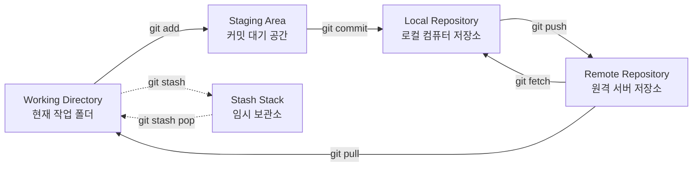
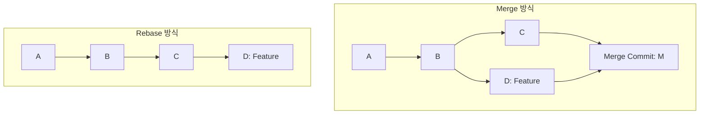

Git은 소스코드의 버전 관리와 협업을 위한 필수적인 도구입니다. 처음 Git을 접하는 분들도 쉽게 이해할 수 있도록 로컬 저장소 생성부터 고급 브랜치 관리 기법까지 핵심 개념과 필수 명령어를 시각적 흐름과 함께 정리합니다.

---

## 📌 Git의 4가지 주요 작업 영역

Git은 로컬 컴퓨터와 원격 서버 사이에서 데이터를 4가지 공간으로 분류하여 추적하고 관리합니다.



---

## 1. Git 전역 환경 설정 (Global Config)

Git을 컴퓨터에 설치한 후 최초 1회만 설정하면 되는 사용자 식별 정보 및 기본 작동 설정입니다.

```bash
# 1. 커밋 시 기록될 사용자 이름과 이메일 등록
git config --global user.name "Your Name"
git config --global user.email "your.email@example.com"

# 2. 개행 문자(Line Ending) 처리 자동 변환 설정
# (Windows 환경의 CRLF를 리눅스/Mac 기반의 LF로 업로드 시 자동 변환)
git config --global core.autocrlf true

# 3. 기본 브랜치명을 master가 아닌 main으로 고정
git config --global init.defaultBranch main

# 4. 등록된 설정 확인
git config --list
```

---

## 2. 빈 폴더에서 원격 저장소(GitHub) 연동하기 (Init & Remote)

기존 원격 저장소를 복사해오는 `git clone` 외에, **내 컴퓨터에 먼저 작성한 코드 폴더를 빈 GitHub 저장소에 처음으로 업로드하고 연결할 때** 사용하는 200% 정석 순서입니다.

```bash
# 1. 현재 프로젝트 폴더를 Git 저장소로 초기화 (.git 폴더 생성)
git init

# 2. 폴더 내 모든 파일을 추적 대상(Staging Area)에 추가
git add .

# 3. 첫 번째 로컬 버전을 커밋하여 기록
git commit -m "Initial commit"

# 4. 현재 기본 브랜치 이름을 main으로 강제 변경
git branch -M main

# 5. GitHub 웹사이트에서 만든 빈 원격 레포지토리 주소를 로컬에 연결
git remote add origin https://github.com/your-username/your-repository-name.git

# 6. 등록된 원격 저장소 이름과 주소 정보 확인 (-v: verbose)
git remote -v

# 7. 첫 push 실행과 동시에 로컬 main 브랜치와 원격 origin/main 브랜치를 영구 동기화 (-u: upstream)
git push -u origin main
```

---

## 3. Fetch vs Pull 차이점 (그리고 --prune 정리)

원격 저장소의 최신 변경 내용을 로컬로 가져오는 두 가지 명령어는 내부 작동 방식이 다릅니다.

### 🔄 Fetch vs Pull 개념 비교
* **`git fetch`:** 원격 저장소의 최신 기록을 가져오기만 하고, **내 로컬 소스 코드 파일(Working Directory)에는 병합하지 않는 안전한 방식**입니다. 변경 이력을 임시로 확인한 후 신중하게 병합하고 싶을 때 사용합니다.
* **`git pull`:** `git fetch`를 수행한 후, 그 변경 이력을 현재 내 로컬 브랜치에 **자동으로 병합(Merge)까지 완료하는 방식**입니다. 작업 중이던 코드가 있다면 충돌(Conflict)이 발생할 수 있습니다.

```bash
# 원격의 최신 커밋 이력만 가져오기
git fetch origin

# 원격의 이력과 내 로컬 코드를 병합하기
git pull origin main
```

### 🧹 유령 브랜치를 지워주는 `fetch --prune`
협업을 하다 보면 원격 서버(GitHub)에서는 이미 삭제된 브랜치인데, 내 로컬 컴퓨터의 원격 브랜치 목록(`git branch -r`로 확인되는 `origin/some-feature` 등)에는 여전히 유령처럼 남아있는 현상이 발생합니다. 

이때 `--prune` 옵션을 주어 가져오면 **원격에서 사라진 브랜치 정보를 내 로컬 기록에서도 깨끗하게 동기화하여 삭제**해 줍니다.

```bash
# 원격 저장소의 소멸된 브랜치 이력을 내 로컬에서 지우며 갱신
git fetch origin --prune
# 또는 pull 시점에 자동 정리 실행
git pull --prune
```

---

## 4. 임시 보관소 사용법 (Stash & Stash Pop)

작업 도중 급하게 다른 브랜치로 이동하거나, 내 코드를 커밋하지 않고 원격의 다른 내용만 잠깐 가져와 테스트해야 할 때 사용하는 **임시 책상 서랍 공간**입니다.

* **주의:** 추적되지 않는 새 파일(Untracked File)은 `-u` 옵션을 붙여야 stash에 안전하게 들어갑니다.

```bash
# 1. 작업 중이던 파일들을 임시 보관소 스택에 넣어 보관하고 작업 디렉토리를 깨끗하게 만들기
git stash
# (추적되지 않는 신규 파일까지 보관할 때)
git stash -u

# 2. 보관소에 저장되어 있는 임시 목록 확인
git stash list

# 3. 보관된 작업 가져오기
# 방법 A: 가장 최근에 보관한 내용을 꺼내 현재 폴더에 복원하고, 보관함에서 삭제 (가장 권장)
git stash pop

# 방법 B: 최근 보관 내용을 가져오되, 보관함 목록에도 그대로 보관 유지
git stash apply

# 4. 보관된 항목 삭제하기
# 특정 인덱스 항목 삭제 (예: stash@{0})
git stash drop stash@{0}
# 보관함 전체 삭제
git stash clear
```

---

## 5. 작업 취소 및 되돌리기 (Restore & Reset)

수정한 소스코드를 커밋 이전으로 돌리거나 이미 수행한 커밋을 취소해야 할 때 사용하는 핵심 되돌리기 가이드입니다.

### ↩️ 현재 수정한 파일 취소 (`git restore`)
```bash
# 1. 특정 파일의 수정 사항을 마지막 커밋 상태로 되돌리기 (수정 취소)
git restore file-name.md

# 2. 현재 폴더 및 하위 폴더의 모든 파일 수정 사항을 일괄 취소하기
git restore .

# 3. git add를 통해 Staging Area에 올린 파일을 다시 내리기 (Unstage)
git restore --staged file-name.md
# (전체 Unstage 처리)
git restore --staged .
```

### 🔄 커밋 히스토리 되돌리기 (`git reset`)
이미 `git commit`을 눌러 생성된 이력을 과거의 특정 커밋 상태로 취소합니다. 리셋 시 뒤따르는 옵션 3가지는 매우 중요하므로 구별하여 사용해야 합니다.

```bash
# [기본 문법] git reset --옵션 [되돌아갈 대상]

# 1. 상대 경로 지정 (HEAD~N): 최근 커밋 취소할 때 사용
# (예: 최근 1개의 커밋 취소)
git reset --mixed HEAD~1

# 2. 특정 커밋 해시(ID) 지정: 내 로컬의 특정 과거 시점으로 롤백할 때 사용
# (예: git log --oneline 으로 확인한 커밋 해시 3a2c1b5로 되돌아가기)
git reset --hard 3a2c1b5

# 3. 원격 브랜치 지정 (origin/브랜치명): 로컬 작업을 다 버리고 서버 코드로 강제 동기화할 때 사용
# (예: 로컬 코드가 꼬여서 GitHub 서버의 main 브랜치와 100% 동일하게 초기화하기)
git reset --hard origin/main
```

> 💡 **실무 핵심 팁: Reset 후 Restore 연계 취소 기법**
> 
> "방금 로컬에 커밋한 작업을 취소하여 파일 수정 상태(Changes)로 되돌려놓고, 그 수정본(Changes)마저도 아예 원상복구(삭제)하여 깨끗한 상태로 만들고 싶을 때" 사용하는 조합입니다.
> 
> 1. **`git reset HEAD~1`**
>    * 방금 생성했던 로컬 커밋을 해제하여, 파일들을 커밋 대기 전 상태인 **수정 단계(Unstaged Changes)**로 되돌려 놓습니다.
> 2. **`git restore .`**
>    * 수정 단계로 내려온 변경 내역들을 **전부 마지막 커밋 원본 상태로 복원**하여 깨끗하게 삭제합니다.
> 
> *참고: 이 방법은 안전하게 코드를 확인한 후 원복 여부를 결정할 수 있으므로 처음부터 `--hard` 옵션을 써서 코드를 영구 유실하는 위험을 크게 줄여줍니다.*

| **옵션 명칭** | **내 작업 파일 (Working Directory)** | **인덱스 영역 (Staging Area)** | **용도 및 특징** |
| --- | --- | --- | --- |
| **`--soft`** | **유지** (수정코드 보존) | **유지** (`git add` 된 상태) | 커밋 메시지만 새로 고치거나 여러 개의 최근 커밋을 묶어서 하나로 재커밋할 때 사용합니다. (가장 안전) |
| **`--mixed`**<br>*(기본값)* | **유지** (수정코드 보존) | **삭제** (Unstage 상태로 변경) | 커밋을 취소하고 파일을 수정 상태로 둔 상태에서, 추가할 파일들만 골라 처음부터 다시 `git add` 하고 싶을 때 사용합니다. |
| **`--hard`** | **강제 삭제** (완전 원복) | **강제 삭제** (완전 원복) | **경고:** 지정한 과거 커밋 이후에 수정한 모든 코드와 파일들이 흔적도 없이 컴퓨터에서 날아갑니다. 완전한 초기화가 필요할 때만 극히 주의해서 사용합니다. |

---

## 6. 브랜치 합치기 기법: Merge vs Rebase

서로 다른 브랜치에서 개발된 기능을 메인(main) 줄기에 합치는 두 가지 다른 방식입니다.



### 1) Merge (병합)
* **방식:** 두 브랜치의 뿌리(Base)는 그대로 둔 채, 두 브랜치를 하나로 묶어주는 **새로운 합병 커밋(Merge Commit)**을 생성하여 합칩니다.
* **장점:** 히스토리가 진행 순서대로 그대로 남으므로 과거 개발 추적이 정확합니다.
* **단점:** 여러 명의 개발자가 빈번하게 병합을 하면 Git 히스토리 트리가 심각하게 얽히고설켜 지저분해집니다.

### 2) Rebase (재배치)
* **방식:** 내 기능 브랜치(`feature`)의 시작 포인트(Base)를 타겟 메인 브랜치의 **최신 커밋 상태로 뿌리를 재배치(Rebase)**하여 이력을 한 줄로 깔끔하게 정렬합니다.
* **장점:** 머지 커밋이 남지 않으며, 모든 작업 내역이 선형(Linear)으로 일렬배치되어 커밋 히스토리가 아주 깨끗하게 유지됩니다.
* **단점:** 공용 브랜치(이미 push되어 팀원들이 같이 쓰는 main 등)에 Rebase를 수행하면 히스토리가 꼬여 엄청난 충돌과 대혼란이 발생합니다. **반드시 내가 로컬에서 혼자 작업하는 기능 브랜치에서만 사용해야 합니다.**

```bash
# feature 브랜치에서 main 브랜치 최신 내용을 리베이스하기
git checkout feature
git rebase main
```
